# finFindR
finFindR is an R and c++ based library for doing photo recognition on dolphins.

Currently, the finFindR app is in beta which you can download using the link to the setup  file bellow.

The App provides an interface to the core library functionality, Including automated image cropping, image tracing and catalogue matching using a tripletLoss network trained in mxnet.<br />

__App Download link:__<br />
https://github.com/haimeh/finFindR/releases
<br /><br />

## Overall Process

Raw images collected in the field are prepped for cataloging in two steps.
A neural network isolates fins from the image and selects a buffered region that surrounds each contiguous region of activation <br />
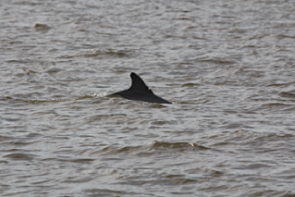
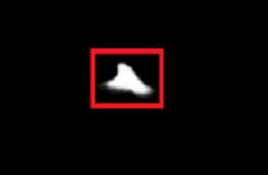 <br />
Each selection is then cropped and saved <br />
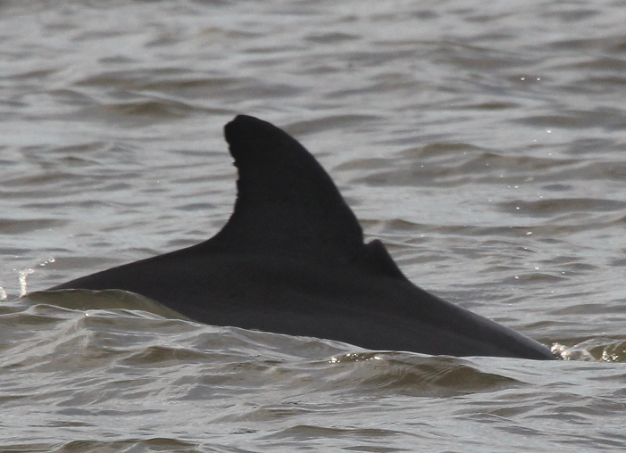 <br /><br />

Once the image is cropped it is prepared for matching by further cropping the image to isolate the trailing edge. <br />
The matching process begins with an edge tracing algorithm programmed in finFindR which, 
from the crop, the enhanced canny-edges(white) are calculated and the optimal-trace(red) is extracted. <br />
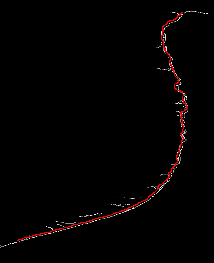<br /><br />

This optimal path is used as a guide to extract the input for the neural network.
The input takes the form of 300 samples from along the optimal path.
Each sample consists of a ring around the sample position where the ring is composed of 16 subsamples of the image values. <br />
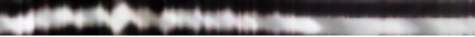 <br />
These measurements quantify overall shape and details such as knicks.<br /><br />

The matching algorithm consisted of a deep convolutional neural network
based on the ResNet architecture, which generates a large-margin nearest neighbor metric. The
network was trained using a k-neighbors soft-triplet loss objective.
The neural network defines a mapping from the raw input data to an embedding where the distances between instances of a given individual are closer to each other than to instances of other individuals. The nearest neighbor metric produced by the neural network discriminates and
matches dorsal fins by computing a “distance” on the embedding from the characteristics of one fin to characteristics of other fins. Shorter distances represent fin pairs with similar nick and notch characteristics, and therefore express putative matches.
<br /><br />

## Getting Started with the App!

Launch the app with the icon placed on your home screen by the installer. You will be presented with the home screen:
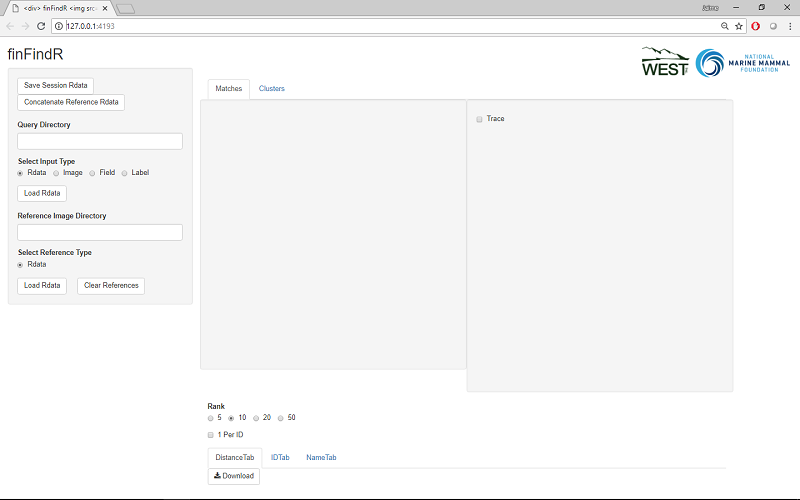 <br />
Looking on the Left hand side you will se the control panel.
Depending on the process needed, there are 4 different input types to chose from:<br />
__Rdata:__ Loads a previously saved catalogue<br />
__Image:__ Begins processing a new catalogue from a directory of cropped images<br />
__Field:__ Preprocesses raw field images by cropping<br />
__Label:__ Labels processed images via csv (generated in finBase)<br />
<br />
We will walk through a hypothetical season to demonstrate these functionalities.

# Field
## Preprocessing Raw Field Images

By selecting Field as the Input Type you will be presented with the folowing panel:
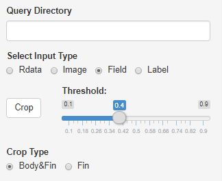 <br />
The __Crop__ button begins the process and iterates through all images in the location typed into in the __Query Directory__ box. A progress bar will appear in the lower right.
The app also iterates through sub directories within the Query Directory if any are present.<br />
As each image is processed, the crops are saved in a new directory which duplicates the the structure of the Query Directory.<br />
The Query Directory is "12_09_14" in the following diagram.
finFindR creates a new directory "12_09_14_finFindR-Crops" where the crops are saved.
Note how the names and structure of the directory are preserved.<br />
The image names are also preserved but with the addition of a "_1.jpg" or "_2.jpg". These additions indicate the number of fins found in the image. For most images in the below example, there was only 1 fin with a few exceptions where there were two or none.
<br />
```bash
├───12_09_14
│   ├───S1_07-13-15
│   │   └───101EOS1D
│   │           S1 S1 006.JPG
│   │           S1 S1 007.JPG
│   │           S1 S1 008.JPG
│   │           S1 S1 009.JPG
│   │           S1 S1 010.JPG
│   │
│   ├───S2_07-14-15
│   │   ├───106CANON
│   │   │       S2 S6 092.JPG
│   │   │       S2 S6 093.JPG
│   │   │       S2 S6 094.JPG
│   │   │       S2 S6 095.JPG
│   │   │
│   │   └───107CANON
│   │           S2 S7 105.JPG
│   │           S2 S7 106.JPG
│   │           S2 S7 107.JPG
│   │           S2 S7 108.JPG
│   │
│   └───S3_07-15-15
│       └───101EOS1D
│               S3 S1 001.JPG
│               S3 S1 002.JPG
│               S3 S1 003.JPG
│               S3 S1 004.JPG
│               S3 S1 005.JPG
│
└───12_09_14_finFindR-Crops
    ├───S1_07-13-15
    │   └───101EOS1D
    │           S1 S1 006_1.jpg
    │           S1 S1 007_1.jpg
    │           S1 S1 008_1.jpg
    │           S1 S1 009_1.jpg
    │           S1 S1 010_1.jpg
    │           S1 S1 010_2.jpg
    │
    ├───S2_07-14-15
    │   ├───106CANON
    │   │       S2 S6 095_1.jpg
    │   │
    │   └───107CANON
    │           S2 S7 105_1.jpg
    │           S2 S7 106_1.jpg
    │           S2 S7 107_1.jpg
    │           S2 S7 108_1.jpg
    │
    └───S3_07-15-15
        └───101EOS1D
                S3 S1 002_1.jpg
                S3 S1 002_2.jpg
                S3 S1 003_1.jpg
                S3 S1 003_2.jpg
                S3 S1 004_1.jpg
                S3 S1 005_1.jpg
```
<br />
Field mode also offers the ability to change the sensitivity via the __Threshold:__ slider bar. If the app is cropping too many false positives, you can increase the threshold and if the app is missing fins, you can decrease the threshold.<br />
There is also the option to crop tightly around the fin or to include any visible body via the __CropType__ buttons.

# Image
## Cataloguing New Images
By selecting Image as the Input Type you will be presented the __Trace__ button which begins the cataloging process.<br />
In the __Query Directory__ box, provide a path containing some cropped images; such as "12_09_14_finFindR-Crops\S1_07-13-15\101EOS1D" from the above example.
When you begin, a progress bar will appear in the lower right.<br />
When complete we can save via the __Save Session Rdata__ button in the top left.<br />
This will add a file named __finFindR.Rdata__ as bellow. A popup will indicate when the save is complete.
<br />
```bash
└───12_09_14_finFindR-Crops
    ├───S1_07-13-15
    │   └───101EOS1D
    │           S1 S1 006_1.jpg
    │           S1 S1 007_1.jpg
    │           S1 S1 008_1.jpg
    │           S1 S1 009_1.jpg
    │           S1 S1 010_1.jpg
    │           S1 S1 010_2.jpg
    │           finFindR.Rdata
```

# Rdata
## Loading Previously Catalogued Images
By selecting Rdata as the Input Type you will be presented the __Load Rdata__ button which loads in a previously saved catalogue.<br />
In the __Query Directory__ box, provide a path containing a finFindR.Rdata save file; such as "12_09_14_finFindR-Crops\S1_07-13-15\101EOS1D" from the above example.
<br /><br />
The Rdata files are also used in the __Reference Image Directory__ box by providing a path containing a finFindR.Rdata save file. The reference directory will also iterate through all sub directories, unlike the Query directory, to find finFindR.Rdata files, so by providing the root directory like "12_09_14_finFindR-Crops\", the app will load in all Rdata from the sub directories.

# Comparing Fins
## Matches Tab
When you have data loaded into both the Query and Reference boxes, the app will compare each individual in the query directory against all individuals in the Reference directory. A progress bar will appear in the lower right corner.<br />
When this process is complete, a table is shown below the two windows where fins can be displayed:<br />
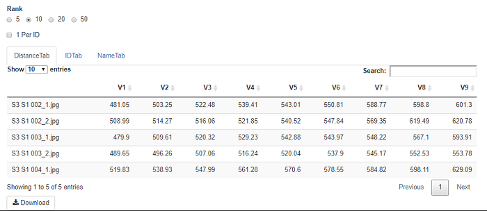 <br />
Each row represents an individual image from the Query directory.<br />
Each column representes a potential match from the Reference directory, ordered by proximity of match from left to right.<br />
Cells from the table can be clicked to show the pair of images.<br />
The __Rank__ selection, lets you chose how many potential matches you want to see in the table. This will also be the number of columns saved in csv generated from the __Download__ button at the bottom of the table.<br />
The table offers 3 ways the data can be viewed.<br />
First there is the __DistanceTab__ which is the metric generated by the neural network for grouping individuals. Smaller numbers indicate better (closer) matches.<br />
The __IDTab__ shows the id associated with a given cell. Selecting the __1 Per ID__ checkbox limits all tabs in the table to only show the best match for each unique ID.<br />
The __NameTab__ shows the image name for each cell.<br />
<br />
The user selection is kept synchronized between all the Table tabs.<br />

## Clusters Tab
This can be a convenient way of looking at how the neural network is grouping individuals. Do bear in mind that this view can be slow for large catalogs. Once images are loaded from either the Query directory, Reference directory, Or both; a dendrogram is rendered, showing an estimate of how individuals are clustered by the neural network as well as a visualization of the neural network output:
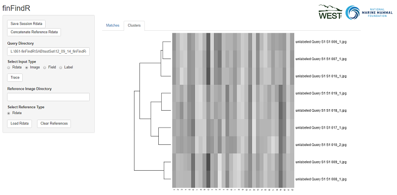 <br />
Each row represents an individual and the length of the branches of the dendrogram on the left, indicate the proximity of the match. Rows can be clicked on to render the individual represented by that row:
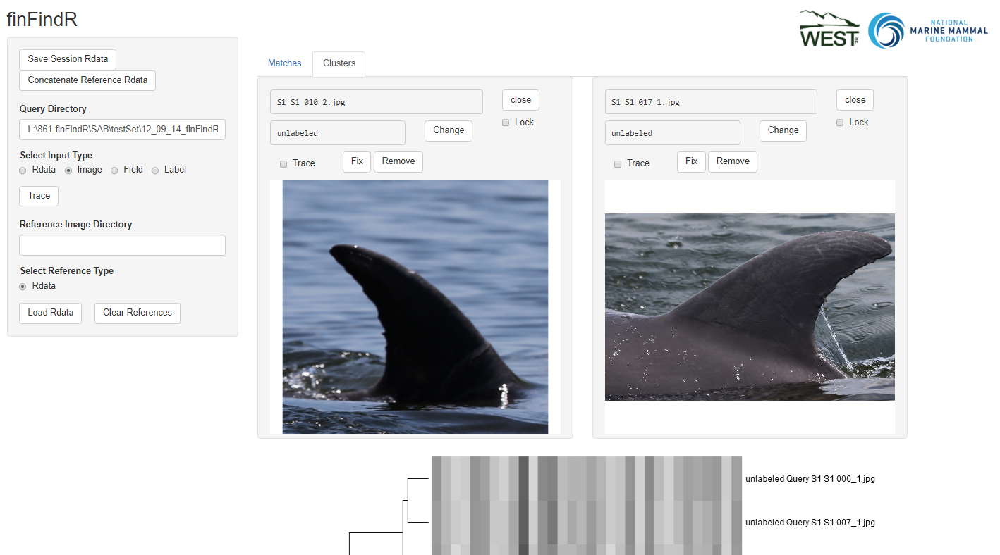 <br />
You can select multiple individuals by clicking and dragging accross a reion of the dendrogram, and single clicking on your selection to render windows for the individuals inside. Alternatively, you can double click your selection to zoom in on the specified region. This can make clicking on a specific individual easier.
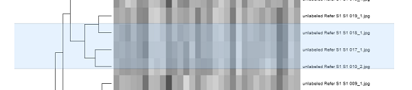 <br />
In between selections of individuals, you can click the __lock__ chekcbox in the upper right corner of a window to keep it open for comparison.<br />

## Modifying
Only images loaded in from the Query directory can be modified.<br />
From either the Cluster or Matches tabs, a window showing a Query individual will have the following in its header:<br />
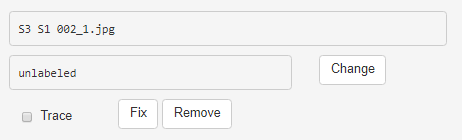 <br />
The upper most box simply shows the name of the image.<br />
Below that is the ID assigned to the individual. This can be modified by clicking the __Change__ button. Once clicked, the ID can be modified: <br />
 <br />
You can type in the new ID and click __Set__ to assign it or leave it blank and click __Set__ to leave the ID unchanged.<br />
The __Trace__ checkbox shows or hides the region of interest the network is using to identify the fin.<br />
By clicking the __Fix__ button, you can click the tip of the fin and the bottom of the trailing edge to redirect the networks attention.<br />
__Remove__ removes the image from the session data.<br /><br />
__Dont forget to Save if you want the Rdata file to remember the changes you make to the session data__

# Label
## Assigns id to image from csv
By selecting Label as the Input Type you will be presented with a browser button which lets you select a csv:<br />
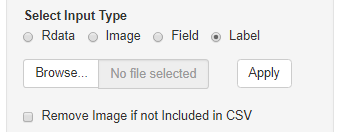 <br />
If you already have assigned id's to images from another source, finFindR can be made to use these labels via a csv. This csv file must contain at least two columns:<br />
  Image: The name of the image file, such as fin.JPG<br />
  CatalogID: The desired id to be associated with the Image<br />
<br />
You can also remove fins from the session by omiting them from the csv and selecting __Remove Image if not Included in CSV__<br /><br />

## Concatenate Reference Data
Providing the path to the root for all the directories containing finFindR.Rdata files to the __Reference Image Directory__ box. For the previous examples the root directory would be "12_09_14_finFindR-Crops\"
<br />
Press the __Concatenate Reference Data__ in the upper left and a popup will indicate when the finFindR.Rdata files have been successfuly combined and saved in the directory specified:<br />
```bash
└───12_09_14_finFindR-Crops
    │
    ├───finFindR.Rdata
    │
    ├───S1_07-13-15
    │   └───101EOS1D
    │           S1 S1 006_1.jpg
    │           S1 S1 007_1.jpg
    │           S1 S1 008_1.jpg
    │           S1 S1 009_1.jpg
    │           S1 S1 010_1.jpg
    │           S1 S1 010_2.jpg
    │           finFindR.Rdata
    │
    └───S3_07-15-15
        └───101EOS1D
                S3 S1 002_1.jpg
                S3 S1 002_2.jpg
                S3 S1 003_1.jpg
                S3 S1 003_2.jpg
                S3 S1 004_1.jpg
                S3 S1 005_1.jpg
                finFindR.Rdata
```
<br />
Now create a new directory to hold the images and the newly created finFindR.Rdata file.
<br />

```bash
└───12_09_14_NewCatalogue
        S3 S1 002_1.jpg
        S3 S1 002_2.jpg
        S3 S1 003_1.jpg
        S3 S1 003_2.jpg
        S3 S1 004_1.jpg
        S3 S1 005_1.jpg
        S1 S1 006_1.jpg
        S1 S1 007_1.jpg
        S1 S1 008_1.jpg
        S1 S1 009_1.jpg
        S1 S1 010_1.jpg
        S1 S1 010_2.jpg
        finFindR.Rdata
```
